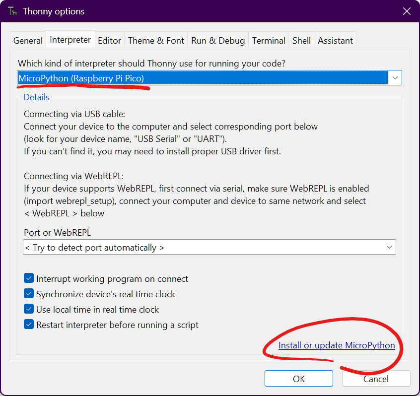
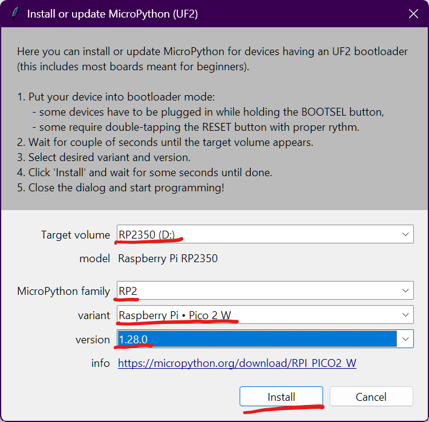
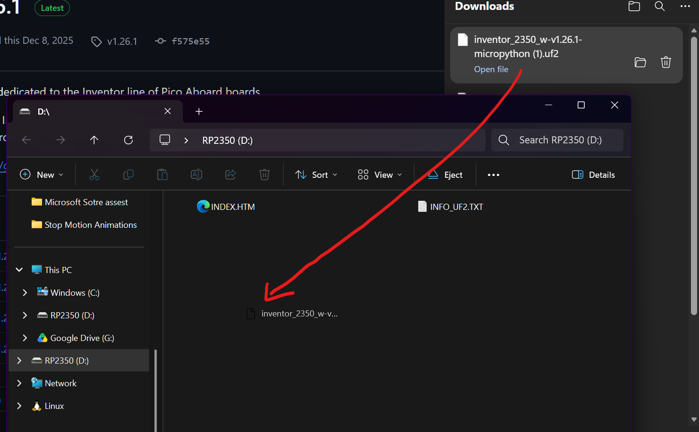

# Installing firmware on Pi Pico 2 W

## Standard Pi Pico 2 W
1. Connect you Pi Pico while holding the "BOOTSEL" button

2. Open Thonney and at the top, hover over "Run" and click "Configure interpreter...".  

2. In the window that appears, make sure "MicroPython Raspberry Pi (Pico)" is selected from the drop down, then click "Install or update MicroPython".  
    

3. Select the options shown in the picture below and click "Install".  
    

4. When done click "close" and "ok" to get back to the main window.

## Inventor 2350 W (Pico 2 W Aboard)

1. Connect you Pi Pico while holding the "BOOTSEL" button

2. These boards have there own custom firmware. Download it at this link [inventor_2350_w-v1.26.1-micropython.uf2](https://github.com/pimoroni/inventor/releases/download/v1.26.1/inventor_2350_w-v1.26.1-micropython.uf2)

3. In file explorer you should see a drive called "RP2350". Drag the downloaded file into that drive.  
    
4. Wait for it to finish uploading and your done.
